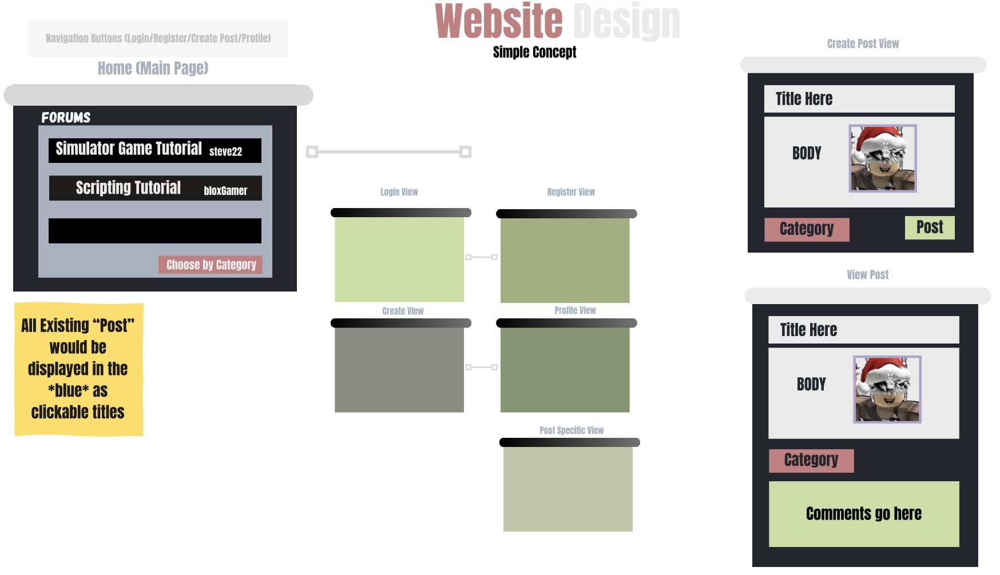

# RoDev-Application
Summer 2025 User Interface Programming Project

Taking a big inspiration from my years of Roblox game development, I wanted to create a basic "Dev Forum" posting site where users (developers) can post in various categories in order to ask for help about anything related to their development project and be able to even publish resources themselves for other developers to use in their own project. Users will also be able to follow one another, "favorite" a post, and a possible tracker for contribution of an existing post. Developers will be able to also "tag" their post for easier discovery.

Simple Design of the general website navigation connections would be.
